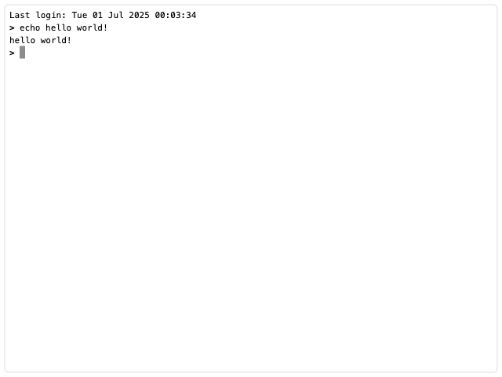

# 🖥️ Simple Terminal Made in JavaScript

A lightweight, embeddable terminal interface written in plain JavaScript. It simulates a command-line experience in the browser, complete with basic commands, command history, blinking cursor, and keyboard input.



The goal of this project isn't to create a fully working terminal with all features, rather a super simple terminal environment that can be added for fun anywhere, for whatever reason.

## ✨ Features

- Interactive terminal prompt
- Adding custom commands
- Command history (with arrow key navigation)
- Simulated blinking cursor
- Easily embeddable in any HTML page

#### Commands available as of now:

<pre>clear, date, echo, help, history, man, ping, whoami</pre>

## 🚀 Getting Started

### 📝 How to use

#### I. Importing script locally

```bash
git clone https://github.com/fbongcam/simple-js-terminal.git
```

Copy **terminal.min.js** from **dist** folder

```js
import { Terminal } from "./terminal.min.js";
```

```js
const terminal = new Terminal(true);
document.body.appendChild(terminal);
```

*Note:* document.body can of course be replaced with any element.

#### II. CDN

*soon*

#### III. npm

```bash
npm install simple-js-terminal
```

```js
import { Terminal } from 'simple-js-terminal';

const terminal = new Terminal();
```

## 🔨 Build

```bash
git clone https://github.com/fbongcam/simple-js-terminal.git
```

```bash
npm run build
```

You will end up with an archive of the newly built **npm package** and a dist folder containing **terminal.min.js**.

## License

Copyright 2025 fbongcam

Permission is hereby granted, free of charge, to any person obtaining a copy of this software and associated documentation files (the “Software”), to deal in the Software without restriction, including without limitation the rights to use, copy, modify, merge, publish, distribute, sublicense, and/or sell copies of the Software, and to permit persons to whom the Software is furnished to do so, subject to the following conditions:

The above copyright notice and this permission notice shall be included in all copies or substantial portions of the Software.

THE SOFTWARE IS PROVIDED “AS IS”, WITHOUT WARRANTY OF ANY KIND, EXPRESS OR IMPLIED, INCLUDING BUT NOT LIMITED TO THE WARRANTIES OF MERCHANTABILITY, FITNESS FOR A PARTICULAR PURPOSE AND NONINFRINGEMENT. IN NO EVENT SHALL THE AUTHORS OR COPYRIGHT HOLDERS BE LIABLE FOR ANY CLAIM, DAMAGES OR OTHER LIABILITY, WHETHER IN AN ACTION OF CONTRACT, TORT OR OTHERWISE, ARISING FROM, OUT OF OR IN CONNECTION WITH THE SOFTWARE OR THE USE OR OTHER DEALINGS IN THE SOFTWARE.
